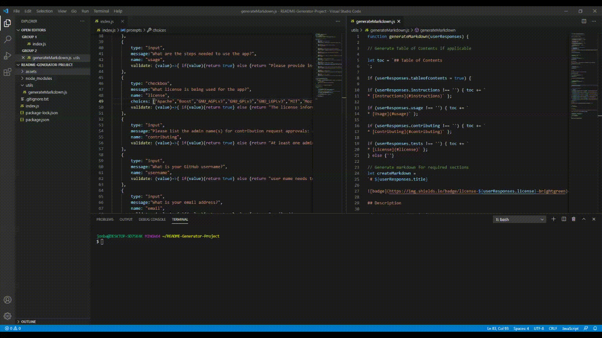

# Dynamic README Generator

 

## Description 

An application that automates the README construction process. It allows a user to provide the content for a README file and translates it into the necessary markdown format.

## Table of Contents

* [Instructions](#instructions)
* [Usage](#usage)
* [Contributing](#contributing)
* [License](#license)
    
## Installation
    
*Here are the steps to install the necessary components to run the program*
    
A `.gitignore` file containing `node_modules/` and `.DS_Store/` directory is needed to prevent issues with GitHub. The file should be created before npm dependencies are installed. The repo will need to include a `package.json` by running `npm init` in the initial project setup. If any visual aids are to be included in the README file, they will need to saved in an assets folder before the README generating process.
    
## Usage 
    
*Instructions on how to run and use the program*
    
To run the application, intiate the user prompts by typing `node index.js` in the terminal and then answer the questions.

[Link to Video](https://drive.google.com/file/d/1tK0q7ASLa7Xu9xMRTxHPCORuMUvZjo-C/view)
    
## Contributing
    
*To make contributions to the app, please reach out to the following admin(s) for approval:*
Jon Baldree

## License
    
Licensed under the  License.

---
    
## Questions?
    
If you have any questions, you can reach out to me through the below GitHub site or send an email to me at: jon.baldree@gmail.com
   
GitHub: https://github.com/jlbaldree
